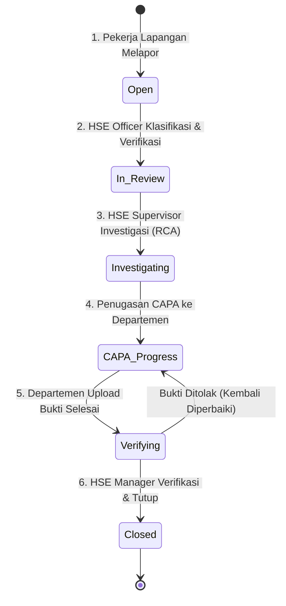
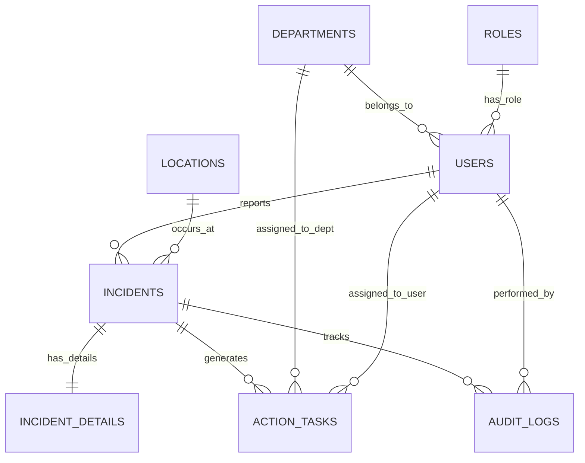

# Dokumen Spesifikasi Kebutuhan Perangkat Lunak (SRS)
## Sistem Informasi Manajemen Insiden K3 Tambang (SafeMine-HSE)

> [!NOTE]
> Dokumen ini dirancang sebagai acuan analisis dan perancangan pengembangan sistem pelaporan insiden Kesehatan dan Keselamatan Kerja (K3) pada sektor pertambangan menggunakan **Laravel 11**. Dokumen ini telah disesuaikan dengan kondisi riil di lapangan (area tambang) serta standar regulasi K3 di Indonesia (Kepmen ESDM No. 1827 K/30/MEM/2018).

---

## 1. Pendahuluan & Analisis Lapangan (Field Analysis)

Pengoperasian sistem pelaporan K3 di area pertambangan memiliki karakteristik unik dan tantangan operasional yang tinggi. Berikut adalah analisis keselarasan sistem dengan kondisi nyata di lapangan:

### 1.1 Tantangan Lapangan & Solusi Sistem
1. **Keterbatasan Sinyal (Blank Spot Area):**
   * **Masalah:** Pekerja lapangan sering berada di area pit, jalan hauling, atau disposal yang tidak terjangkau sinyal internet 4G/Wi-Fi secara stabil.
   * **Solusi Laravel/Frontend:** Implementasi **Progressive Web App (PWA)** dengan modul **Service Worker**. Form pelaporan awal menggunakan penyimpanan lokal sementara (**LocalStorage/IndexedDB**) saat offline. Begitu perangkat mendeteksi koneksi internet (online), antrean laporan otomatis terkirim ke server Laravel melalui background sync API.
2. **Kapasitas Bandwidth & Ukuran Berkas:**
   * **Masalah:** Mengunggah foto berukuran asli (5MB - 10MB) langsung dari kamera ponsel di area tambang akan memakan waktu lama dan sering gagal akibat koneksi lambat.
   * **Solusi Laravel:** Sebelum berkas diunggah, kompresi gambar dilakukan di sisi klien (menggunakan Javascript library seperti *Compressor.js*) dan di sisi server Laravel menggunakan package **Intervention Image** untuk memperkecil ukuran berkas gambar menjadi maksimal 500KB tanpa menghilangkan detail penting.
3. **Akurasi Lokasi Kejadian:**
   * **Masalah:** Menulis nama lokasi secara manual sering menimbulkan ambiguitas (misal: "Dekat tikungan Pit A" vs "Hauling Road KM 12").
   * **Solusi Laravel:** Memanfaatkan browser **HTML5 Geolocation API** untuk menangkap koordinat garis lintang (latitude) dan bujur (longitude) secara presisi saat form pelaporan diisi. Sistem kemudian memetakan koordinat tersebut ke titik terdekat pada daftar lokasi tambang di database (*Geofencing* sederhana).

---

## 2. Alur Sistem Terintegrasi (System Workflow)

Proses penanganan insiden dikelompokkan dalam 5 fase terstruktur dengan siklus hidup tiket yang jelas.



### Detail Siklus Hidup Tiket & Aksi Pengguna:
1. **Fase 1: Identifikasi & Pelaporan (Status: `Open`)**
   * **Aktor:** Pekerja Lapangan (Semua User).
   * **Input:** Kategori temuan (KTA - Kondisi Tidak Aman, TTA - Tindakan Tidak Aman, atau Insiden Nyata), deskripsi singkat, foto bukti, koordinat GPS otomatis, dan lokasi makro (misal: Pit A East).
   * **Sistem:** Mengirim notifikasi WhatsApp otomatis ke HSE Officer bahwa ada laporan baru masuk dengan tingkat urgensi awal.
2. **Fase 2: Tinjauan Awal & Klasifikasi (Status: `In Review`)**
   * **Aktor:** HSE Officer.
   * **Aksi:** Memverifikasi validitas foto dan lokasi. Menentukan tingkat keparahan risiko berdasarkan Matriks Risiko K3:
     * *Low* / *Medium* / *High* / *Critical*.
   * **Sistem:** Jika tingkat keparahan bertipe **Critical**, sistem akan memicu alarm notifikasi SMS/WhatsApp instan ke seluruh jajaran manajemen K3 dan Direktur Operasional (KTT - Kepala Teknik Tambang).
3. **Fase 3: Investigasi & Analisis Akar Masalah (Status: `Investigating`)**
   * **Aktor:** HSE Supervisor.
   * **Aksi:** Turun ke lapangan untuk memimpin investigasi. Mengisi form analisis akar masalah menggunakan metode **5 Whys** atau klasifikasi kode **SCAT (Systematic Cause Analysis Technique)** langsung di sistem.
4. **Fase 4: Penugasan Tindakan Perbaikan (Status: `CAPA Progress`)**
   * **Aktor:** Departemen Terkait (PIC Departemen).
   * **Aksi:** Menerima tugas perbaikan (CAPA). Contoh: Departemen Engineering ditugaskan menimbun jalan longsor. PIC departemen memperbarui status menjadi *In Progress*, lalu mengunggah foto bukti *After* (setelah perbaikan) beserta catatan teknis begitu tugas selesai.
5. **Fase 5: Verifikasi Akhir & Penutupan (Status: `Closed`)**
   * **Aktor:** HSE Manager.
   * **Aksi:** Meninjau perbandingan foto *Before vs After*, kesesuaian tindakan preventif agar tidak terulang kembali. Jika OK, status diubah menjadi **Closed**. Jika belum sesuai standar, status dikembalikan ke **CAPA Progress** dengan catatan revisi.

---

## 3. Arsitektur Database (Relational Schema)

Desain database dinormalisasi untuk menjaga integritas data, mendukung transaksi tinggi, serta memudahkan kueri pelaporan statistik bulanan.

### 3.1 Skema Relasi Antar Tabel (ERD)



### 3.2 Kamus Data Detail & Desain Kolom
Di bawah ini adalah rancangan tabel yang siap diimplementasikan langsung ke dalam Laravel Migrations.

#### Tabel: `departments`
Menyimpan struktur departemen kerja di perusahaan tambang.
* `id` (BigInt, PK, Auto Increment)
* `department_name` (Varchar 100)
* `dept_code` (Varchar 10, Unique) - Contoh: `HSE`, `ENG`, `MIN`, `HRD`, `PLT`
* `created_at` & `updated_at`

#### Tabel: `users`
Tabel pengguna dengan relasi ke departemen dan otorisasi peran.
* `id` (BigInt, PK, Auto Increment)
* `name` (Varchar 255)
* `email` (Varchar 255, Unique)
* `password` (Varchar 255)
* `phone_number` (Varchar 20, Nullable) - Digunakan untuk pengiriman notifikasi WhatsApp
* `department_id` (BigInt, FK ke `departments.id`, Nullable)
* `is_active` (Boolean, Default: True)
* `remember_token` & Timestamps

#### Tabel: `locations`
Daftar lokasi fisik di dalam area konsesi pertambangan.
* `id` (BigInt, PK, Auto Increment)
* `site_name` (Varchar 100) - Contoh: `Pit A`, `Hauling Road KM 12`, `Workshop North`
* `area_type` (Enum: `'Pit'`, `'Hauling'`, `'Disposal'`, `'Workshop'`, `'Office'`, `'Port'`)
* `latitude` (Decimal 10, 8, Nullable)
* `longitude` (Decimal 11, 8, Nullable)
* `created_at` & `updated_at`

#### Tabel: `incidents`
Menyimpan data utama transaksi tiket insiden (dioptimalkan untuk pencarian status cepat).
* `id` (BigInt, PK, Auto Increment)
* `ticket_number` (Varchar 30, Unique) - Format: `INC/YYYYMMDD/XXXX`
* `reporter_id` (BigInt, FK ke `users.id`)
* `location_id` (BigInt, FK ke `locations.id`)
* `category` (Enum: `'KTA'`, `'TTA'`, `'Near Miss'`, `'Accident'`)
* `status` (Enum: `'Open'`, `'In Review'`, `'Investigating'`, `'CAPA Progress'`, `'Verifying'`, `'Closed'`)
* `severity` (Enum: `'Low'`, `'Medium'`, `'High'`, `'Critical'`, Nullable) - Diisi saat *In Review*
* `incident_date` (DateTime)
* `created_at` & `updated_at`

#### Tabel: `incident_details`
Memisahkan data deskriptif yang berukuran besar untuk meningkatkan performa pembacaan indeks tabel `incidents`.
* `id` (BigInt, PK, Auto Increment)
* `incident_id` (BigInt, FK ke `incidents.id`, Cascade On Delete)
* `description` (Text) - Kronologi kejadian lengkap
* `initial_action` (Text, Nullable) - Tindakan langsung yang diambil di TKP
* `photo_before` (Varchar 255) - Path berkas foto kondisi saat ditemukan
* `root_cause` (Text, Nullable) - Diisi saat investigasi (hasil analisis 5 Whys)
* `created_at` & `updated_at`

#### Tabel: `action_tasks` (CAPA)
Menyimpan tugas perbaikan teknis yang ditugaskan ke departemen pelaksana.
* `id` (BigInt, PK, Auto Increment)
* `incident_id` (BigInt, FK ke `incidents.id`)
* `assigned_department_id` (BigInt, FK ke `departments.id`)
* `assigned_user_id` (BigInt, FK ke `users.id`, Nullable) - PIC pelaksana
* `task_description` (Text) - Instruksi detail perbaikan
* `due_date` (Date) - Batas waktu pengerjaan (SLA)
* `status` (Enum: `'Pending'`, `'In Progress'`, `'Completed'`, `'Overdue'`)
* `photo_after` (Varchar 255, Nullable) - Foto bukti setelah dilakukan perbaikan
* `completion_notes` (Text, Nullable) - Catatan teknis dari departemen pelaksana
* `completed_at` (DateTime, Nullable)
* `created_at` & `updated_at`

#### Tabel: `audit_logs`
Rekam jejak kepatuhan dan audit trail sistem.
* `id` (BigInt, PK, Auto Increment)
* `incident_id` (BigInt, FK ke `incidents.id`)
* `user_id` (BigInt, FK ke `users.id`) - Aktor yang melakukan aksi
* `action` (Varchar 100) - Contoh: `'Status Changed'`, `'Assigned CAPA'`, `'Uploaded Photo After'`
* `old_values` (Json, Nullable) - Keadaan sebelum perubahan
* `new_values` (Json, Nullable) - Keadaan setelah perubahan
* `ip_address` (Varchar 45)
* `user_agent` (Text)
* `created_at` (Timestamp)

---

## 4. Implementasi Kode Laravel (Database Migration & Model Relation)

Di bawah ini disajikan implementasi migrasi database menggunakan sintaks Laravel 11.

### 4.1 Laravel Migrations

```php
// File: database/migrations/2026_07_05_000001_create_k3_tables.php
use Illuminate\Database\Migrations\Migration;
use Illuminate\Database\Schema\Blueprint;
use Illuminate\Support\Facades\Schema;

return new class extends Migration
{
    public function up(): void
    {
        Schema::create('departments', function (Blueprint $table) {
            $table->id();
            $table->string('department_name', 100);
            $table->string('dept_code', 10)->unique();
            $table->timestamps();
        });

        Schema::create('locations', function (Blueprint $table) {
            $table->id();
            $table->string('site_name', 100);
            $table->enum('area_type', ['Pit', 'Hauling', 'Disposal', 'Workshop', 'Office', 'Port']);
            $table->decimal('latitude', 10, 8)->nullable();
            $table->decimal('longitude', 11, 8)->nullable();
            $table->timestamps();
        });

        Schema::create('incidents', function (Blueprint $table) {
            $table->id();
            $table->string('ticket_number', 30)->unique();
            $table->foreignId('reporter_id')->constrained('users');
            $table->foreignId('location_id')->constrained('locations');
            $table->enum('category', ['KTA', 'TTA', 'Near Miss', 'Accident']);
            $table->enum('status', ['Open', 'In Review', 'Investigating', 'CAPA Progress', 'Verifying', 'Closed'])->default('Open');
            $table->enum('severity', ['Low', 'Medium', 'High', 'Critical'])->nullable();
            $table->dateTime('incident_date');
            $table->timestamps();

            // Indexes for Performance Optimization
            $table->index(['status', 'severity']);
            $table->index('ticket_number');
        });

        Schema::create('incident_details', function (Blueprint $table) {
            $table->id();
            $table->foreignId('incident_id')->constrained('incidents')->cascadeOnDelete();
            $table->text('description');
            $table->text('initial_action')->nullable();
            $table->string('photo_before');
            $table->text('root_cause')->nullable(); // RCA 5 Whys
            $table->timestamps();
        });

        Schema::create('action_tasks', function (Blueprint $table) {
            $table->id();
            $table->foreignId('incident_id')->constrained('incidents');
            $table->foreignId('assigned_department_id')->constrained('departments');
            $table->foreignId('assigned_user_id')->nullable()->constrained('users');
            $table->text('task_description');
            $table->date('due_date');
            $table->enum('status', ['Pending', 'In Progress', 'Completed', 'Overdue'])->default('Pending');
            $table->string('photo_after')->nullable();
            $table->text('completion_notes')->nullable();
            $table->dateTime('completed_at')->nullable();
            $table->timestamps();
        });

        Schema::create('audit_logs', function (Blueprint $table) {
            $table->id();
            $table->foreignId('incident_id')->constrained('incidents');
            $table->foreignId('user_id')->constrained('users');
            $table->string('action', 100);
            $table->json('old_values')->nullable();
            $table->json('new_values')->nullable();
            $table->string('ip_address', 45)->nullable();
            $table->text('user_agent')->nullable();
            $table->timestamp('created_at')->useCurrent();
        });
    }

    public function down(): void
    {
        Schema::dropIfExists('audit_logs');
        Schema::dropIfExists('action_tasks');
        Schema::dropIfExists('incident_details');
        Schema::dropIfExists('incidents');
        Schema::dropIfExists('locations');
        Schema::dropIfExists('departments');
    }
};
```

### 4.2 Laravel Eloquent Relationship Definition

Definisi relasi antar Model pada Laravel untuk mendukung kueri ORM yang bersih.

```php
// File: app/Models/Incident.php
namespace App\Models;

use Illuminate\Database\Eloquent\Model;
use Illuminate\Database\Eloquent\Relations\BelongsTo;
use Illuminate\Database\Eloquent\Relations\HasOne;
use Illuminate\Database\Eloquent\Relations\HasMany;

class Incident extends Model
{
    protected $fillable = [
        'ticket_number', 'reporter_id', 'location_id', 
        'category', 'status', 'severity', 'incident_date'
    ];

    public function reporter(): BelongsTo
    {
        return $this->belongsTo(User::class, 'reporter_id');
    }

    public function location(): BelongsTo
    {
        return $this->belongsTo(Location::class);
    }

    public function details(): HasOne
    {
        return $this->hasOne(IncidentDetail::class);
    }

    public function actionTasks(): HasMany
    {
        return $this->hasMany(ActionTask::class);
    }

    public function auditLogs(): HasMany
    {
        return $this->hasMany(AuditLog::class)->orderBy('created_at', 'desc');
    }
}
```

---

## 5. Analisis Implementasi Fitur Unggulan (Killer Features)

Untuk memikat rekruter dan membuktikan pemahaman industri yang mendalam, kita akan mengimplementasikan fitur ini menggunakan pustaka Laravel standar industri.

### 5.1 Fitur 1: Audit Trail / Log Riwayat Perubahan (Timeline)
* **Cara Kerja:** Setiap kali ada mutasi status pada tabel `incidents` atau pembuatan `action_tasks`, Laravel Model Observer (`IncidentObserver`) akan secara otomatis merekam perubahan tersebut ke tabel `audit_logs`.
* **Kode Observer untuk Logging Otomatis:**

```php
// File: app/Observers/IncidentObserver.php
namespace App\Observers;

use App\Models\Incident;
use App\Models\AuditLog;
use Illuminate\Support\Facades\Auth;
use Illuminate\Support\Facades\Request;

class IncidentObserver
{
    public function updated(Incident $incident): void
    {
        if ($incident->isDirty('status') || $incident->isDirty('severity')) {
            AuditLog::create([
                'incident_id' => $incident->id,
                'user_id'     => Auth::id() ?? 1, // Fallback ke System/Admin
                'action'      => 'Status/Severity Changed',
                'old_values'  => json_encode(array_intersect_key($incident->getOriginal(), $incident->getDirty())),
                'new_values'  => json_encode($incident->getDirty()),
                'ip_address'  => Request::ip(),
                'user_agent'  => Request::userAgent(),
            ]);
        }
    }
}
```

* **Tampilan UI (Aesthetics):**
  Frontend menggunakan komponen timeline berdesain modern (Glassmorphism + Tailwind/Custom CSS) dengan ikon status berwarna dinamis berdasarkan tingkat keparahan dan tipe aksi.

---

### 5.2 Fitur 2: Integrasi Notifikasi WhatsApp (Fonnte API)
* **Alasan Lapangan:** Karyawan tambang di lapangan jarang membuka email. Menggunakan notifikasi instan WhatsApp menjamin respon cepat (SLA) untuk insiden kritis (*Critical/High Severity*).
* **Cara Kerja:** Pemicuan notifikasi menggunakan Laravel **Queue & Jobs** (`SendWhatsAppNotification`) agar proses pemuatan halaman pelapor tidak terhambat oleh respons API pihak ketiga.
* **Fungsi Wrapper Layanan WhatsApp:**

```php
// File: app/Services/WhatsAppService.php
namespace App\Services;

use Illuminate\Support\Facades\Http;
use Illuminate\Support\Facades\Log;

class WhatsAppService
{
    protected string $token;
    protected string $apiUrl = 'https://api.fonnte.com/send';

    public function __construct()
    {
        $this->token = config('services.fonnte.token');
    }

    public function sendNotification(string $recipient, string $message): bool
    {
        try {
            $response = Http::withHeaders([
                'Authorization' => $this->token,
            ])->post($this->apiUrl, [
                'target' => $recipient,
                'message' => $message,
                'countryCode' => '62', // Default Indonesia
            ]);

            if ($response->successful()) {
                return true;
            }

            Log::error('Fonnte API Error: ' . $response->body());
            return false;
        } catch (\Exception $e) {
            Log::error('WhatsApp Notification Exception: ' . $e->getMessage());
            return false;
        }
    }
}
```

---

### 5.3 Fitur 3: Ekspor Laporan PDF & Excel (DomPDF & Laravel Excel)
* **Kebutuhan Lapangan:** Setiap rapat bulanan K3 (P2K3 - Panitia Pembina Keselamatan dan Kesehatan Kerja), manajemen puncak memerlukan berkas cetak fisik dalam bentuk laporan PDF (untuk arsip resmi bertanda tangan) atau Excel (untuk analisis pivot data lebih lanjut).
* **Teknologi:**
  * **PDF:** Menggunakan package `barryvdh/laravel-dompdf`. Laporan diformat dengan template HTML profesional yang menyertakan grafik persentase tipe insiden, status penyelesaian CAPA, dan tabel rekapitulasi.
  * **Excel:** Menggunakan package `maatwebsite/excel` dengan fitur *FromView* atau *WithMapping* agar formatting kolom rapi dan formula bawaan Excel tetap bekerja.

```php
// File: app/Exports/IncidentMonthlyExport.php
namespace App\Exports;

use App\Models\Incident;
use Maatwebsite\Excel\Concerns\FromCollection;
use Maatwebsite\Excel\Concerns\WithHeadings;
use Maatwebsite\Excel\Concerns\WithMapping;

class IncidentMonthlyExport implements FromCollection, WithHeadings, WithMapping
{
    protected int $month;
    protected int $year;

    public function __construct(int $month, int $year)
    {
        $this->month = $month;
        $this->year = $year;
    }

    public function collection()
    {
        return Incident::with(['reporter', 'location', 'details'])
            ->whereMonth('incident_date', $this->month)
            ->whereYear('incident_date', $this->year)
            ->get();
    }

    public function headings(): array
    {
        return ['No. Tiket', 'Pelapor', 'Lokasi', 'Kategori', 'Status', 'Keparahan', 'Tanggal Kejadian'];
    }

    public function map($incident): array
    {
        return [
            $incident->ticket_number,
            $incident->reporter->name,
            $incident->location->site_name,
            $incident->category,
            $incident->status,
            $incident->severity ?? 'Unclassified',
            $incident->incident_date,
        ];
    }
}
```

---

## 6. Struktur Paket (Package Recommendations) & Rekomendasi Stack

Agar pengembangan aplikasi cepat dan mengikuti standar industri modern, disarankan menggunakan kombinasi stack berikut:

| Nama Package / Library | Fungsi Utama | Keunggulan Lapangan |
| :--- | :--- | :--- |
| **Laravel Breeze** (atau **Jetstream**) | Kerangka Autentikasi Pengguna | Keamanan standar industri (bcrypt, rate limiting, sesi). |
| **Filament PHP** | Admin Panel & Dashboard | Sangat cepat dikembangkan untuk antarmuka HSE Officer, Supervisor, dan Manager tanpa menulis banyak HTML/CSS. |
| **Spatie Laravel Permission** | Manajemen Akses Kontrol Berbasis Peran (RBAC) | Membatasi menu edit/tinjau agar pekerja lapangan tidak bisa mengubah status klasifikasi tiket atau CAPA. |
| **Livewire** (atau **Inertia.js + Vue**) | Reaktivitas Antarmuka | Mempercepat pengisian form dinamis (seperti 5 Whys RCA) tanpa memuat ulang (refresh) halaman. |
| **Intervention Image** | Kompresi & Pemrosesan Gambar | Otomatis mengecilkan resolusi foto insiden di server sebelum disimpan ke disk. |
| **Barryvdh Laravel DomPDF** | Konversi HTML ke PDF | Mempermudah pembuatan dokumen laporan bulanan K3 resmi. |

---

## 7. Metrik Analisis K3 (Dashboard KPIs)

Sebagai nilai tambah yang sangat tinggi di mata industri pertambangan, dashboard utama HSE Manager wajib menampilkan metrik standar global berikut:
1. **LTIFR (Lost Time Injury Frequency Rate):**
   $$\text{LTIFR} = \frac{\text{Jumlah Kecelakaan Kerja Hilang Hari Kerja} \times 1.000.000}{\text{Total Jam Kerja Orang (Man Hours)}}$$
2. **TRIR (Total Recordable Incident Rate):**
   Mengukur frekuensi kejadian insiden yang dapat dicatat per sejuta jam kerja.
3. **Persentase Penyelesaian CAPA (CAPA Closure Rate):**
   $$\text{Closure Rate \%} = \frac{\text{CAPA Status 'Completed'}}{\text{Total CAPA Terbit}} \times 100\%$$
   * Target industri biasanya $>90\%$ selesai dalam kurun waktu SLA yang telah ditentukan.
